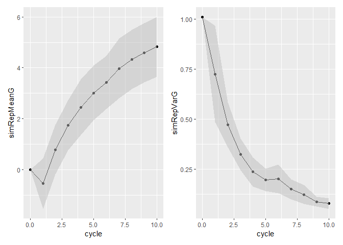

Domestication Syndrome Simulation
================
Nathan Fumia
10/31/2021

## Run the simulation once with nCycles

Here we set up the founder population of haplotypes using Markovian
Coalescent Simulator (MaCS) and introduce parameters to the population
using “SimParam()”.

``` r
library(AlphaSimR)
```

    ## Warning: package 'AlphaSimR' was built under R version 4.1.1

    ## Loading required package: R6

``` r
library(tidyverse)
```

    ## -- Attaching packages --------------------------------------- tidyverse 1.3.1 --

    ## v ggplot2 3.3.4     v purrr   0.3.4
    ## v tibble  3.1.2     v dplyr   1.0.6
    ## v tidyr   1.1.3     v stringr 1.4.0
    ## v readr   1.4.0     v forcats 0.5.1

    ## -- Conflicts ------------------------------------------ tidyverse_conflicts() --
    ## x dplyr::filter() masks stats::filter()
    ## x dplyr::lag()    masks stats::lag()
    ## x dplyr::mutate() masks AlphaSimR::mutate()

``` r
rm(list=ls())
# SET-UP FOUNDER POPULATION
founderHap <- runMacs2(nInd=100,nChr=11,segSites=100)
# New global simulation parameters from founder haplotypes
SP <- SimParam$new(founderHap)
SP$restrSegSites(minQtlPerChr=10,minSnpPerChr=10,overlap=FALSE)
SP$addTraitA(nQtlPerChr=10,mean=0,var=1) # Additive trait genetic architecture
SP$setSexes("no") #all individuals are hermaphrodites
SP$addSnpChip(nSnpPerChr=10) # Observed SNPs per chromosome 
SP$setTrackPed(TRUE) #keeps pedigree information in slot SP@pedigree 
SP$setTrackRec(TRUE) #keeps recomb. records of all individuals in slot of "SP"
# New founder pop
founders <- newPop(founderHap,simParam=SP)
# Initial founder phenotypes
founders <- setPheno(pop=founders,h2=0.5,reps=2)

# loop length / number of cycles of selection
nCycles<-10
# very simple container for each cycles sim output
simOutput<-list(founders)
cycle<-1
for(cycle in 1:nCycles){
  cat(paste0(" C",cycle))
  # choose the best from last cycle
  chosenParents<- selectInd(pop=simOutput[[cycle]],nInd=5,use="pheno")
  # make crosses 
  offspringPop<-randCross(pop=chosenParents, 
                          nCrosses=10,nProgeny = 10)
  # phenotype  new offspring
  offspringPop<-setPheno(pop = offspringPop,h2=0.5,reps=2)
  # add new offspring to simOutput list
  simOutput[[cycle+1]]<-offspringPop
}
```

    ##  C1 C2 C3 C4 C5 C6 C7 C8 C9 C10

``` r
# Tidy up to output
tidySimOutput<-tibble(Cycle=0:nCycles,
       Sims=simOutput) %>% 
  mutate(meanG=map_dbl(Sims,~mean(.@gv)),
         varG=map_dbl(Sims,~var(.@gv)))
tidySimOutput
```

    ## # A tibble: 11 x 4
    ##    Cycle Sims       meanG   varG
    ##    <int> <list>     <dbl>  <dbl>
    ##  1     0 <Pop>  -4.44e-17 1.01  
    ##  2     1 <Pop>   1.60e+ 0 0.461 
    ##  3     2 <Pop>   2.74e+ 0 0.406 
    ##  4     3 <Pop>   3.66e+ 0 0.225 
    ##  5     4 <Pop>   4.22e+ 0 0.215 
    ##  6     5 <Pop>   4.98e+ 0 0.0797
    ##  7     6 <Pop>   5.28e+ 0 0.0787
    ##  8     7 <Pop>   5.53e+ 0 0.115 
    ##  9     8 <Pop>   5.88e+ 0 0.0597
    ## 10     9 <Pop>   6.20e+ 0 0.0415
    ## 11    10 <Pop>   6.43e+ 0 0.0186

Making A Kinship Matrix & Using for Mixed Model

``` r
ped <- as.data.frame(SP$pedigree) #set dataframe
ped <- ped[,-3]
ped$id <- rownames(ped)
head(distinct(ped))
```

    ##   mother father id
    ## 1      0      0  1
    ## 2      0      0  2
    ## 3      0      0  3
    ## 4      0      0  4
    ## 5      0      0  5
    ## 6      0      0  6

``` r
id <- as.numeric(ped[,3])
mother <- as.numeric(ped[,1])
father <- as.numeric(ped[,2])

library(kinship2)
```

    ## Loading required package: Matrix

    ## 
    ## Attaching package: 'Matrix'

    ## The following objects are masked from 'package:tidyr':
    ## 
    ##     expand, pack, unpack

    ## Loading required package: quadprog

``` r
K <- kinship2::kinship(id=id,dadid=father,momid=mother)*2

Y <- as.data.frame(cbind(offspringPop@id,offspringPop@pheno))
colnames(Y) <- c("id","trait")
Y$trait <- as.numeric(Y$trait)

library(sommer)
```

    ## Warning: package 'sommer' was built under R version 4.1.1

    ## Loading required package: MASS

    ## 
    ## Attaching package: 'MASS'

    ## The following object is masked from 'package:dplyr':
    ## 
    ##     select

    ## Loading required package: lattice

    ## Loading required package: crayon

    ## 
    ## Attaching package: 'crayon'

    ## The following object is masked from 'package:ggplot2':
    ## 
    ##     %+%

``` r
ans <- mmer(trait~1,
     random=~vs(id,Gu=K),
     rcov=~units,
     data=Y)
```

    ## Adding additional levels of Gu in the model matrix of 'id' 
    ## iteration    LogLik     wall    cpu(sec)   restrained
    ##     1      -49.5987   10:7:34      0           0
    ##     2      -49.5378   10:7:34      0           0
    ##     3      -49.5067   10:7:34      0           1
    ##     4      -49.5   10:7:34      0           1
    ##     5      -49.5   10:7:34      0           1

``` r
summary(ans)
```

    ## ============================================================
    ##          Multivariate Linear Mixed Model fit by REML         
    ## **********************  sommer 4.1  ********************** 
    ## ============================================================
    ##       logLik AIC      BIC Method Converge
    ## Value  -49.5 101 103.6052     NR     TRUE
    ## ============================================================
    ## Variance-Covariance components:
    ##                   VarComp VarCompSE Zratio Constraint
    ## u:id.trait-trait   0.0000   0.17627  0.000   Positive
    ## units.trait-trait  0.5024   0.08451  5.944   Positive
    ## ============================================================
    ## Fixed effects:
    ##   Trait      Effect Estimate Std.Error t.value
    ## 1 trait (Intercept)    6.292   0.07088   88.77
    ## ============================================================
    ## Groups and observations:
    ##      trait
    ## u:id  1100
    ## ============================================================
    ## Use the '$' sign to access results and parameters

``` r
library(AlphaSimR)
library(tidyverse)

code<- replicate(10,{

rm(list=ls())
# SET-UP FOUNDER POPULATION
founderHap <- runMacs2(nInd=100,nChr=11,segSites=100)
# New global simulation parameters from founder haplotypes
SP <- SimParam$new(founderHap)
SP$restrSegSites(minQtlPerChr=10,minSnpPerChr=10,overlap=FALSE)
SP$addTraitA(nQtlPerChr=10,mean=0,var=1) # Additive trait genetic architecture
SP$setSexes("no") #all individuals are hermaphrodites
SP$addSnpChip(nSnpPerChr=10) # Observed SNPs per chromosome 
SP$setTrackPed(TRUE) #keeps pedigree information in slot SP@pedigree 
SP$setTrackRec(TRUE) #keeps recomb. records of all individuals in slot of "SP"
# New founder pop
founders <- newPop(founderHap,simParam=SP)
# Initial founder phenotypes
founders <- setPheno(pop=founders,h2=0.5,reps=2)

# loop length / number of cycles of selection
nCycles<-10
# very simple container for each cycles sim output
simOutput<-list(founders)
cycle<-1
for(cycle in 1:nCycles){
  cat(paste0(" C",cycle))
  # choose the best from last cycle
  chosenParents<- selectInd(pop=simOutput[[cycle]],nInd=5,use="pheno")
    ##GEBV "sommer" package
      ###extract phenotypes and genotypes as vector matrices
      ###pullSnpGeno()
    ##Contribution selection (no inbreeding - preserve diversity)
      ### "optiSel" package for optimal selection
  # make crosses 
  offspringPop<-randCross(pop=chosenParents, 
                          nCrosses=10,nProgeny = 10)
  # phenotype  new offspring
  offspringPop<-setPheno(pop = offspringPop,h2=0.5,reps=2)
  # add new offspring to simOutput list
  simOutput[[cycle+1]]<-offspringPop
}

# Tidy up to output
tidySimOutput<-tibble(Cycle=0:nCycles,
       Sims=simOutput) %>% 
  mutate(meanG=map_dbl(Sims,~mean(.@gv)),
         varG=map_dbl(Sims,~var(.@gv)))
tidySimOutput
}, simplify=FALSE)
```

    ##  C1 C2 C3 C4 C5 C6 C7 C8 C9 C10 C1 C2 C3 C4 C5 C6 C7 C8 C9 C10 C1 C2 C3 C4 C5 C6 C7 C8 C9 C10 C1 C2 C3 C4 C5 C6 C7 C8 C9 C10 C1 C2 C3 C4 C5 C6 C7 C8 C9 C10 C1 C2 C3 C4 C5 C6 C7 C8 C9 C10 C1 C2 C3 C4 C5 C6 C7 C8 C9 C10 C1 C2 C3 C4 C5 C6 C7 C8 C9 C10 C1 C2 C3 C4 C5 C6 C7 C8 C9 C10 C1 C2 C3 C4 C5 C6 C7 C8 C9 C10

``` r
library(purrr)
result <- lapply(purrr::transpose(code), function(x) do.call(cbind, x))
```

``` r
# Create dataframe of replicated simulation
simRepMeanG<-rowMeans(result$meanG)
simRepVarG<-rowMeans(result$varG)
simRepMeanGsd<- apply(result$meanG,1, sd, na.rm = TRUE)
simRepVarGsd<- apply(result$varG,1, sd, na.rm = TRUE)
cycle<-c(0:nCycles)

simRepData<- as.data.frame(t(rbind(cycle,simRepMeanG,simRepMeanGsd,simRepVarG,simRepVarGsd)))
```

``` r
library(patchwork)
```

    ## Warning: package 'patchwork' was built under R version 4.1.1

    ## 
    ## Attaching package: 'patchwork'

    ## The following object is masked from 'package:MASS':
    ## 
    ##     area

``` r
# Plot replicated simulation for clean plots
meanGplot<-ggplot(simRepData,aes(x=cycle,y=simRepMeanG)) + geom_point() + geom_line() + geom_ribbon(aes(ymin=simRepMeanG-simRepMeanGsd,ymax=simRepMeanG+simRepMeanGsd),fill="grey",alpha=0.5) 
varGplot<-ggplot(simRepData,aes(x=cycle,y=simRepVarG)) + geom_point() + geom_line() + geom_ribbon(aes(ymin=simRepVarG-simRepVarGsd,ymax=simRepVarG+simRepVarGsd),fill="grey",alpha=0.5) 
meanGplot | varGplot
```

<!-- -->

## R Markdown

This is an R Markdown document. Markdown is a simple formatting syntax
for authoring HTML, PDF, and MS Word documents. For more details on
using R Markdown see <http://rmarkdown.rstudio.com>.
