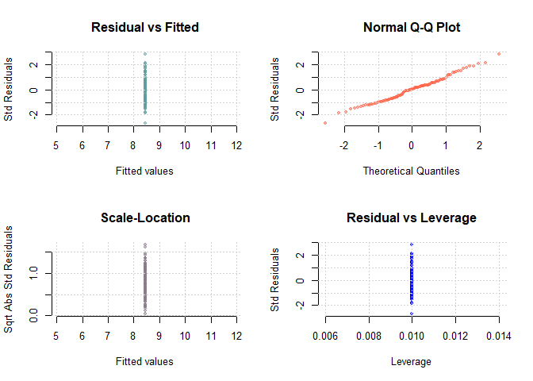

Domestication Syndrome Simulation
================
Nathan Fumia
10/31/2021

## Run the simulation once with nCycles

Here we set up the founder population of haplotypes using Markovian
Coalescent Simulator (MaCS) and introduce parameters to the population
using “SimParam()”.

``` r
library(AlphaSimR)
```

    ## Warning: package 'AlphaSimR' was built under R version 4.1.1

    ## Loading required package: R6

``` r
library(tidyverse)
```

    ## -- Attaching packages --------------------------------------- tidyverse 1.3.1 --

    ## v ggplot2 3.3.4     v purrr   0.3.4
    ## v tibble  3.1.2     v dplyr   1.0.6
    ## v tidyr   1.1.3     v stringr 1.4.0
    ## v readr   1.4.0     v forcats 0.5.1

    ## -- Conflicts ------------------------------------------ tidyverse_conflicts() --
    ## x dplyr::filter() masks stats::filter()
    ## x dplyr::lag()    masks stats::lag()
    ## x dplyr::mutate() masks AlphaSimR::mutate()

``` r
rm(list=ls())
# SET-UP FOUNDER POPULATION
founderHap <- runMacs2(nInd=100,nChr=11,segSites=100)
# New global simulation parameters from founder haplotypes
SP <- SimParam$new(founderHap)
SP$restrSegSites(minQtlPerChr=10,minSnpPerChr=10,overlap=FALSE)
SP$addTraitA(nQtlPerChr=10,mean=0,var=1) # Additive trait genetic architecture
SP$setSexes("no") #all individuals are hermaphrodites
SP$addSnpChip(nSnpPerChr=10) # Observed SNPs per chromosome 
SP$setTrackPed(TRUE) #keeps pedigree information in slot SP@pedigree 
SP$setTrackRec(TRUE) #keeps recomb. records of all individuals in slot of "SP"
# New founder pop
founders <- newPop(founderHap,simParam=SP)
# Initial founder phenotypes
founders <- setPheno(pop=founders,h2=0.5,reps=2)

# loop length / number of cycles of selection
nCycles<-10
# very simple container for each cycles sim output
simOutput<-list(founders)
cycle<-1
for(cycle in 1:nCycles){
  cat(paste0(" C",cycle))
  # choose the best from last cycle
  chosenParents<- selectInd(pop=simOutput[[cycle]],nInd=5,use="pheno")
  # make crosses 
  offspringPop<-randCross(pop=chosenParents, 
                          nCrosses=10,nProgeny = 10)
  # phenotype  new offspring
  offspringPop<-setPheno(pop = offspringPop,h2=0.5,reps=2)
  # add new offspring to simOutput list
  simOutput[[cycle+1]]<-offspringPop
}
```

    ##  C1 C2 C3 C4 C5 C6 C7 C8 C9 C10

``` r
# Tidy up to output
tidySimOutput<-tibble(Cycle=0:nCycles,
       Sims=simOutput) %>% 
  mutate(meanG=map_dbl(Sims,~mean(.@gv)),
         varG=map_dbl(Sims,~var(.@gv)))
tidySimOutput
```

    ## # A tibble: 11 x 4
    ##    Cycle Sims      meanG   varG
    ##    <int> <list>    <dbl>  <dbl>
    ##  1     0 <Pop>  1.60e-16 1.01  
    ##  2     1 <Pop>  1.80e+ 0 0.676 
    ##  3     2 <Pop>  2.91e+ 0 0.420 
    ##  4     3 <Pop>  4.34e+ 0 0.366 
    ##  5     4 <Pop>  4.94e+ 0 0.304 
    ##  6     5 <Pop>  5.38e+ 0 0.232 
    ##  7     6 <Pop>  6.08e+ 0 0.140 
    ##  8     7 <Pop>  6.24e+ 0 0.0977
    ##  9     8 <Pop>  6.26e+ 0 0.0898
    ## 10     9 <Pop>  6.59e+ 0 0.102 
    ## 11    10 <Pop>  6.90e+ 0 0.0434

# Making Kinship Matrix (K) & Using for Mixed Model

``` r
ped <- as.data.frame(SP$pedigree) #set dataframe
ped <- ped[,-3]
ped$id <- rownames(ped)
head(distinct(ped))
```

    ##   mother father id
    ## 1      0      0  1
    ## 2      0      0  2
    ## 3      0      0  3
    ## 4      0      0  4
    ## 5      0      0  5
    ## 6      0      0  6

``` r
id <- as.numeric(ped[,3])
mother <- as.numeric(ped[,1])
father <- as.numeric(ped[,2])

library(kinship2)
```

    ## Loading required package: Matrix

    ## 
    ## Attaching package: 'Matrix'

    ## The following objects are masked from 'package:tidyr':
    ## 
    ##     expand, pack, unpack

    ## Loading required package: quadprog

``` r
K <- kinship2::kinship(id=id,dadid=father,momid=mother)*2

Y <- as.data.frame(cbind(offspringPop@id,offspringPop@pheno))
colnames(Y) <- c("id","trait")
Y$trait <- as.numeric(Y$trait)

library(sommer)
```

    ## Warning: package 'sommer' was built under R version 4.1.1

    ## Loading required package: MASS

    ## 
    ## Attaching package: 'MASS'

    ## The following object is masked from 'package:dplyr':
    ## 
    ##     select

    ## Loading required package: lattice

    ## Loading required package: crayon

    ## 
    ## Attaching package: 'crayon'

    ## The following object is masked from 'package:ggplot2':
    ## 
    ##     %+%

``` r
ans_ped <- mmer(trait~1,
     random=~vs(id,Gu=K),
     rcov=~units,
     data=Y)
```

    ## Adding additional levels of Gu in the model matrix of 'id' 
    ## iteration    LogLik     wall    cpu(sec)   restrained
    ##     1      -49.1084   11:1:6      1           0
    ##     2      -49.064   11:1:6      1           0
    ##     3      -49.0534   11:1:6      1           0
    ##     4      -49.0526   11:1:6      1           0

``` r
summary(ans_ped)$varcomp
```

    ##                     VarComp VarCompSE    Zratio Constraint
    ## u:id.trait-trait  0.2495549 0.3902731 0.6394366   Positive
    ## units.trait-trait 0.6586918 0.1467441 4.4887114   Positive

# Making Genomic Relationship Matrix (A) & Using for Mixed Model

``` r
library(AlphaSimR)
gen.mat <- pullSnpGeno(offspringPop) #pull genotypes from offspringPop object
library(sommer)
A <- A.mat(gen.mat) #create A genomic relationship matrix

Y <- as.data.frame(cbind(offspringPop@id,offspringPop@pheno)) #create dataframe of traits and id for model
colnames(Y) <- c("id","trait") #rename columns something meaningful
Y$trait <- as.numeric(Y$trait) #make response (trait) numeric
#Y <- Y %>%
#    mutate(trait =  replace(trait, sample(row_number(),  
#           size = ceiling(0.3 * n()), replace = FALSE), NA) )

library(sommer)
#run univariate mixed model with sommer 
##specifying random covariates of id and relationship
##specifying covariance structure by units
ans_gs <- mmer(trait~1,
     random=~vs(id,Gu=A),
     rcov=~units,
     data=Y) 
```

    ## iteration    LogLik     wall    cpu(sec)   restrained
    ##     1      -47.3229   11:1:6      0           0
    ##     2      -47.309   11:1:6      0           0
    ##     3      -47.3031   11:1:6      0           0
    ##     4      -47.302   11:1:6      0           0
    ##     5      -47.3019   11:1:6      0           0

``` r
summary(ans_gs)$varcomp #check variance composition
```

    ##                     VarComp  VarCompSE   Zratio Constraint
    ## u:id.trait-trait  0.1475309 0.09890517 1.491640   Positive
    ## units.trait-trait 0.6271609 0.09564025 6.557499   Positive

``` r
plot(ans_gs) #check normality with visual
```

    ## Warning in plot.window(...): relative range of values ( 0 * EPS) is small (axis
    ## 1)

<!-- -->

``` r
gebv.pb <- as.data.frame(ans_gs$U) #pull genomic estimated breeding values from mixed model
rownames(gebv.pb) <- factor(Y$id,levels = rownames(A)) #place id as rownames of gebv

#how to organize by descending gebv and select top (slice(n:n)) individuals
choose <-tibble(id=Y$id, 
       gebv=gebv.pb$trait) %>% 
  arrange(desc(gebv.pb$trait)) %>% 
  slice(1:5)
```

## Run the simulation once with Genomic selection

``` r
library(AlphaSimR)
library(tidyverse)
library(sommer)
rm(list=ls())
# SET-UP FOUNDER POPULATION
founderHap <- runMacs2(nInd=100,nChr=11,segSites=100)
# New global simulation parameters from founder haplotypes
SP <- SimParam$new(founderHap)
SP$restrSegSites(minQtlPerChr=10,minSnpPerChr=10,overlap=FALSE)
SP$addTraitA(nQtlPerChr=10,mean=0,var=1) # Additive trait genetic architecture
SP$setSexes("no") #all individuals are hermaphrodites
SP$addSnpChip(nSnpPerChr=10) # Observed SNPs per chromosome 
SP$setTrackPed(TRUE) #keeps pedigree information in slot SP@pedigree 
SP$setTrackRec(TRUE) #keeps recomb. records of all individuals in slot of "SP"
# New founder pop
founders <- newPop(founderHap,simParam=SP)
# Initial founder phenotypes
founders <- setPheno(pop=founders,h2=0.5,reps=2)

# loop length / number of cycles of selection
nCycles<-10
# very simple container for each cycles sim output
simOutput<-list(founders)
cycle<-1
for(cycle in 1:nCycles){
  cat(paste0(" C",cycle))
  # choose the best from last cycle with genomic selection
      gen.mat <- pullSnpGeno(simOutput[[cycle]]) #pull genotypes from offspringPop object
      A <- sommer::A.mat(gen.mat) #create A genomic relationship matrix
      Y <- as.data.frame(cbind(simOutput[[cycle]]@id,simOutput[[cycle]]@pheno)) #create dataframe of traits and id for model
      colnames(Y) <- c("id","trait") #rename columns something meaningful
      Y$trait <- as.numeric(Y$trait) #make response (trait) numeric
      #Y <- Y %>%
      #    mutate(trait =  replace(trait, sample(row_number(),  
      #           size = ceiling(0.3 * n()), replace = FALSE), NA) )

      #run univariate mixed model with sommer 
      ##specifying random covariates of id and relationship
      ##specifying covariance structure by units
      ans_gs <- mmer(trait~1,
           random=~vs(id,Gu=A),
           rcov=~units,
            data=Y) 
      #summary(ans_gs)$varcomp #check variance composition
      #plot(ans_gs) #check normality with visual
      gebv.pb <- as.data.frame(ans_gs$U) #pull genomic estimated breeding values from mixed model
      rownames(gebv.pb) <- factor(Y$id,levels = rownames(A)) #place id as rownames of gebv
      #how to organize by descending gebv and select top (slice(n:n)) individuals
      chosenParents <-tibble(id=Y$id, 
            gebv=gebv.pb$trait) %>% 
            arrange(desc(gebv.pb$trait)) %>% 
            slice(1:5)
      chosenParents <- simOutput[[cycle]][chosenParents$id] #subset genomic selected chosenParents from POP to be used in cross
  # make crosses 
  offspringPop<-randCross(pop=chosenParents, 
                          nCrosses=5,nProgeny = 10)
  # phenotype  new offspring
  offspringPop<-setPheno(pop = offspringPop,h2=0.5,reps=2)
  # add new offspring to simOutput list
  simOutput[[cycle+1]]<-offspringPop
}
```

    ##  C1iteration    LogLik     wall    cpu(sec)   restrained
    ##     1      -49.3853   11:1:7      0           0
    ##     2      -49.2624   11:1:7      0           0
    ##     3      -49.2498   11:1:7      0           0
    ##     4      -49.2498   11:1:7      0           0
    ##  C2iteration    LogLik     wall    cpu(sec)   restrained
    ##     1      -22.1083   11:1:8      0           0
    ##     2      -21.4755   11:1:8      0           0
    ##     3      -21.2   11:1:8      0           0
    ##     4      -21.1393   11:1:8      0           0
    ##     5      -21.1345   11:1:8      0           0
    ##     6      -21.1341   11:1:8      0           0
    ##  C3iteration    LogLik     wall    cpu(sec)   restrained
    ##     1      -23.039   11:1:8      0           0
    ##     2      -22.9072   11:1:8      0           0
    ##     3      -22.8634   11:1:8      0           0
    ##     4      -22.8574   11:1:8      0           0
    ##     5      -22.8572   11:1:8      0           0
    ##  C4iteration    LogLik     wall    cpu(sec)   restrained
    ##     1      -23.3269   11:1:8      0           0
    ##     2      -23.0152   11:1:8      0           0
    ##     3      -22.8244   11:1:8      0           0
    ##     4      -22.7629   11:1:8      0           0
    ##     5      -22.7552   11:1:8      0           0
    ##     6      -22.7544   11:1:8      0           0
    ##  C5iteration    LogLik     wall    cpu(sec)   restrained
    ##     1      -24.5776   11:1:8      0           0
    ##     2      -24.5291   11:1:8      0           0
    ##     3      -24.4869   11:1:8      0           0
    ##     4      -24.4611   11:1:8      0           0
    ##     5      -24.4521   11:1:8      0           0
    ##     6      -24.4491   11:1:8      0           0
    ##     7      -24.4482   11:1:8      0           0
    ##  C6iteration    LogLik     wall    cpu(sec)   restrained
    ##     1      -24.778   11:1:8      0           0
    ##     2      -24.5406   11:1:8      0           0
    ##     3      -24.4393   11:1:8      0           0
    ##     4      -24.416   11:1:8      0           0
    ##     5      -24.4129   11:1:8      0           0
    ##     6      -24.4124   11:1:8      0           0
    ##  C7iteration    LogLik     wall    cpu(sec)   restrained
    ##     1      -26.4071   11:1:8      0           0
    ##     2      -25.2178   11:1:8      0           1
    ##     3      -24.5   11:1:8      0           1
    ##     4      -24.5   11:1:8      0           1
    ##  C8iteration    LogLik     wall    cpu(sec)   restrained
    ##     1      -26.2864   11:1:8      0           0
    ##     2      -24.8268   11:1:8      0           1
    ##     3      -24.5   11:1:8      0           1
    ##     4      -24.5   11:1:8      0           1
    ##  C9iteration    LogLik     wall    cpu(sec)   restrained
    ##     1      -25.4   11:1:8      0           0
    ##     2      -24.9188   11:1:8      0           0
    ##     3      -24.5808   11:1:8      0           0
    ##     4      -24.5014   11:1:8      0           0
    ##     5      -24.5   11:1:8      0           0
    ##     6      -24.5   11:1:8      0           0
    ##  C10iteration    LogLik     wall    cpu(sec)   restrained
    ##     1      -26.3526   11:1:8      0           0
    ##     2      -25.5317   11:1:8      0           1
    ##     3      -24.5   11:1:8      0           1
    ##     4      -24.5   11:1:8      0           1

``` r
# Tidy up to output
tidySimOutput<-tibble(Cycle=0:nCycles,
       Sims=simOutput) %>% 
  mutate(meanG=map_dbl(Sims,~mean(.@gv)),
         varG=map_dbl(Sims,~var(.@gv)))
tidySimOutput
```

    ## # A tibble: 11 x 4
    ##    Cycle Sims       meanG  varG
    ##    <int> <list>     <dbl> <dbl>
    ##  1     0 <Pop>  -2.42e-17 1.01 
    ##  2     1 <Pop>  -5.72e- 1 0.757
    ##  3     2 <Pop>   2.23e- 1 0.993
    ##  4     3 <Pop>   1.81e+ 0 0.758
    ##  5     4 <Pop>   3.14e+ 0 0.380
    ##  6     5 <Pop>   3.23e+ 0 0.450
    ##  7     6 <Pop>   3.71e+ 0 0.189
    ##  8     7 <Pop>   3.38e+ 0 0.257
    ##  9     8 <Pop>   3.55e+ 0 0.257
    ## 10     9 <Pop>   3.91e+ 0 0.173
    ## 11    10 <Pop>   4.03e+ 0 0.134

``` r
library(patchwork)
```

    ## Warning: package 'patchwork' was built under R version 4.1.1

    ## 
    ## Attaching package: 'patchwork'

    ## The following object is masked from 'package:MASS':
    ## 
    ##     area

``` r
meanGplot<-ggplot(tidySimOutput,aes(x=Cycle,y=meanG)) + geom_point() + geom_line() 
varGplot<-ggplot(tidySimOutput,aes(x=Cycle,y=varG)) + geom_point() + geom_line() 
meanGplot | varGplot
```

<!-- -->
\#\# Replicate the simulation 10 times and plot the mean and sd of
simulations

``` r
library(AlphaSimR)
library(tidyverse)

code<- replicate(10,{

rm(list=ls())
# SET-UP FOUNDER POPULATION
founderHap <- runMacs2(nInd=100,nChr=11,segSites=100)
# New global simulation parameters from founder haplotypes
SP <- SimParam$new(founderHap)
SP$restrSegSites(minQtlPerChr=10,minSnpPerChr=10,overlap=FALSE)
SP$addTraitA(nQtlPerChr=10,mean=0,var=1) # Additive trait genetic architecture
SP$setSexes("no") #all individuals are hermaphrodites
SP$addSnpChip(nSnpPerChr=10) # Observed SNPs per chromosome 
SP$setTrackPed(TRUE) #keeps pedigree information in slot SP@pedigree 
SP$setTrackRec(TRUE) #keeps recomb. records of all individuals in slot of "SP"
# New founder pop
founders <- newPop(founderHap,simParam=SP)
# Initial founder phenotypes
founders <- setPheno(pop=founders,h2=0.5,reps=2)

# loop length / number of cycles of selection
nCycles<-10
# very simple container for each cycles sim output
simOutput<-list(founders)
cycle<-1
for(cycle in 1:nCycles){
  cat(paste0(" C",cycle))
  # choose the best from last cycle
  chosenParents<- selectInd(pop=simOutput[[cycle]],nInd=5,use="pheno")
    ##GEBV "sommer" package
      ###extract phenotypes and genotypes as vector matrices
      ###pullSnpGeno()
    ##Contribution selection (no inbreeding - preserve diversity)
      ### "optiSel" package for optimal selection
  # make crosses 
  offspringPop<-randCross(pop=chosenParents, 
                          nCrosses=10,nProgeny = 10)
  # phenotype  new offspring
  offspringPop<-setPheno(pop = offspringPop,h2=0.5,reps=2)
  # add new offspring to simOutput list
  simOutput[[cycle+1]]<-offspringPop
}

# Tidy up to output
tidySimOutput<-tibble(Cycle=0:nCycles,
       Sims=simOutput) %>% 
  mutate(meanG=map_dbl(Sims,~mean(.@gv)),
         varG=map_dbl(Sims,~var(.@gv)))
tidySimOutput
}, simplify=FALSE)
```

    ##  C1 C2 C3 C4 C5 C6 C7 C8 C9 C10 C1 C2 C3 C4 C5 C6 C7 C8 C9 C10 C1 C2 C3 C4 C5 C6 C7 C8 C9 C10 C1 C2 C3 C4 C5 C6 C7 C8 C9 C10 C1 C2 C3 C4 C5 C6 C7 C8 C9 C10 C1 C2 C3 C4 C5 C6 C7 C8 C9 C10 C1 C2 C3 C4 C5 C6 C7 C8 C9 C10 C1 C2 C3 C4 C5 C6 C7 C8 C9 C10 C1 C2 C3 C4 C5 C6 C7 C8 C9 C10 C1 C2 C3 C4 C5 C6 C7 C8 C9 C10

``` r
library(purrr)
result <- lapply(purrr::transpose(code), function(x) do.call(cbind, x))
```

### Organize the replicated data into summary stats

``` r
# Create dataframe of replicated simulation
simRepMeanG<-rowMeans(result$meanG)
simRepVarG<-rowMeans(result$varG)
simRepMeanGsd<- apply(result$meanG,1, sd, na.rm = TRUE)
simRepVarGsd<- apply(result$varG,1, sd, na.rm = TRUE)
cycle<-c(0:nCycles)

simRepData<- as.data.frame(t(rbind(cycle,simRepMeanG,simRepMeanGsd,simRepVarG,simRepVarGsd)))
```

### Plot those simulation summary stats

``` r
library(patchwork)
# Plot replicated simulation for clean plots
meanGplot<-ggplot(simRepData,aes(x=cycle,y=simRepMeanG)) + geom_point() + geom_line() + geom_ribbon(aes(ymin=simRepMeanG-simRepMeanGsd,ymax=simRepMeanG+simRepMeanGsd),fill="grey",alpha=0.5) 
varGplot<-ggplot(simRepData,aes(x=cycle,y=simRepVarG)) + geom_point() + geom_line() + geom_ribbon(aes(ymin=simRepVarG-simRepVarGsd,ymax=simRepVarG+simRepVarGsd),fill="grey",alpha=0.5) 
meanGplot | varGplot
```

<!-- -->

## R Markdown

This is an R Markdown document. Markdown is a simple formatting syntax
for authoring HTML, PDF, and MS Word documents. For more details on
using R Markdown see <http://rmarkdown.rstudio.com>.
