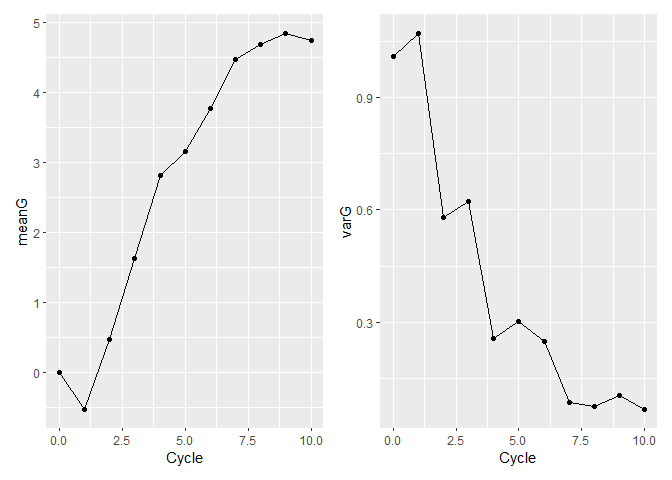

Domestication Syndrome Simulation
================
Nathan Fumia
10/31/2021

## Run the simulation once with nCycles

Here we set up the founder population of haplotypes using Markovian
Coalescent Simulator (MaCS) and introduce parameters to the population
using “SimParam()”.

``` r
library(AlphaSimR)
```

    ## Warning: package 'AlphaSimR' was built under R version 4.1.1

    ## Loading required package: R6

``` r
library(tidyverse)
```

    ## -- Attaching packages --------------------------------------- tidyverse 1.3.1 --

    ## v ggplot2 3.3.4     v purrr   0.3.4
    ## v tibble  3.1.2     v dplyr   1.0.6
    ## v tidyr   1.1.3     v stringr 1.4.0
    ## v readr   1.4.0     v forcats 0.5.1

    ## -- Conflicts ------------------------------------------ tidyverse_conflicts() --
    ## x dplyr::filter() masks stats::filter()
    ## x dplyr::lag()    masks stats::lag()
    ## x dplyr::mutate() masks AlphaSimR::mutate()

``` r
rm(list=ls())
# SET-UP FOUNDER POPULATION
founderHap <- runMacs2(nInd=100,nChr=11,segSites=100)
# New global simulation parameters from founder haplotypes
SP <- SimParam$new(founderHap)
SP$restrSegSites(minQtlPerChr=10,minSnpPerChr=10,overlap=FALSE)
SP$addTraitA(nQtlPerChr=10,mean=0,var=1) # Additive trait genetic architecture
SP$setSexes("no") #all individuals are hermaphrodites
SP$addSnpChip(nSnpPerChr=10) # Observed SNPs per chromosome 
SP$setTrackPed(TRUE) #keeps pedigree information in slot SP@pedigree 
SP$setTrackRec(TRUE) #keeps recomb. records of all individuals in slot of "SP"
# New founder pop
founders <- newPop(founderHap,simParam=SP)
# Initial founder phenotypes
founders <- setPheno(pop=founders,h2=0.5,reps=2)

# loop length / number of cycles of selection
nCycles<-10
# very simple container for each cycles sim output
simOutput<-list(founders)
cycle<-1
for(cycle in 1:nCycles){
  cat(paste0(" C",cycle))
  # choose the best from last cycle
  chosenParents<- selectInd(pop=simOutput[[cycle]],nInd=5,use="pheno")
  # make crosses 
  offspringPop<-randCross(pop=chosenParents, 
                          nCrosses=10,nProgeny = 10)
  # phenotype  new offspring
  offspringPop<-setPheno(pop = offspringPop,h2=0.5,reps=2)
  # add new offspring to simOutput list
  simOutput[[cycle+1]]<-offspringPop
}
```

    ##  C1 C2 C3 C4 C5 C6 C7 C8 C9 C10

``` r
# Tidy up to output
tidySimOutput<-tibble(Cycle=0:nCycles,
       Sims=simOutput) %>% 
  mutate(meanG=map_dbl(Sims,~mean(.@gv)),
         varG=map_dbl(Sims,~var(.@gv)))
tidySimOutput
```

    ## # A tibble: 11 x 4
    ##    Cycle Sims       meanG   varG
    ##    <int> <list>     <dbl>  <dbl>
    ##  1     0 <Pop>  -7.74e-18 1.01  
    ##  2     1 <Pop>   1.84e+ 0 0.489 
    ##  3     2 <Pop>   2.72e+ 0 0.738 
    ##  4     3 <Pop>   4.25e+ 0 0.611 
    ##  5     4 <Pop>   5.52e+ 0 0.690 
    ##  6     5 <Pop>   6.84e+ 0 0.318 
    ##  7     6 <Pop>   7.52e+ 0 0.156 
    ##  8     7 <Pop>   7.97e+ 0 0.0924
    ##  9     8 <Pop>   8.14e+ 0 0.0607
    ## 10     9 <Pop>   8.18e+ 0 0.0855
    ## 11    10 <Pop>   8.42e+ 0 0.0601

# 

# Making Kinship Matrix (K) & Using for Mixed Model

``` r
ped <- as.data.frame(SP$pedigree) #set dataframe
ped <- ped[,-3]
ped$id <- rownames(ped)
head(distinct(ped))
```

    ##   mother father id
    ## 1      0      0  1
    ## 2      0      0  2
    ## 3      0      0  3
    ## 4      0      0  4
    ## 5      0      0  5
    ## 6      0      0  6

``` r
id <- as.numeric(ped[,3])
mother <- as.numeric(ped[,1])
father <- as.numeric(ped[,2])

library(kinship2)
```

    ## Loading required package: Matrix

    ## 
    ## Attaching package: 'Matrix'

    ## The following objects are masked from 'package:tidyr':
    ## 
    ##     expand, pack, unpack

    ## Loading required package: quadprog

``` r
K <- kinship2::kinship(id=id,dadid=father,momid=mother)*2

Y <- as.data.frame(cbind(offspringPop@id,offspringPop@pheno))
colnames(Y) <- c("id","trait")
Y$trait <- as.numeric(Y$trait)

library(sommer)
```

    ## Warning: package 'sommer' was built under R version 4.1.1

    ## Loading required package: MASS

    ## 
    ## Attaching package: 'MASS'

    ## The following object is masked from 'package:dplyr':
    ## 
    ##     select

    ## Loading required package: lattice

    ## Loading required package: crayon

    ## 
    ## Attaching package: 'crayon'

    ## The following object is masked from 'package:ggplot2':
    ## 
    ##     %+%

``` r
ans_ped <- mmer(trait~1,
     random=~vs(id,Gu=K),
     rcov=~units,
     data=Y)
```

    ## Adding additional levels of Gu in the model matrix of 'id' 
    ## iteration    LogLik     wall    cpu(sec)   restrained
    ##     1      -49.5451   12:16:34      0           0
    ##     2      -49.5148   12:16:34      0           0
    ##     3      -49.4988   12:16:34      0           0
    ##     4      -49.4947   12:16:34      0           0
    ##     5      -49.4944   12:16:34      0           0

``` r
summary(ans_ped)$varcomp
```

    ##                     VarComp  VarCompSE    Zratio Constraint
    ## u:id.trait-trait  0.0216340 0.18594073 0.1163489   Positive
    ## units.trait-trait 0.5236685 0.08887354 5.8922876   Positive

# Making Genomic Relationship Matrix (A) & Using for Mixed Model

``` r
library(AlphaSimR)
gen.mat <- pullSnpGeno(offspringPop) #pull genotypes from offspringPop object

library(sommer)
A <- A.mat(gen.mat) #create A genomic relationship matrix

Y <- as.data.frame(cbind(offspringPop@id,offspringPop@pheno)) #create dataframe of traits and id for model
colnames(Y) <- c("id","trait") #rename columns something meaningful
Y$trait <- as.numeric(Y$trait) #make response (trait) numeric
#Y <- Y %>%
#    mutate(trait =  replace(trait, sample(row_number(),  
#           size = ceiling(0.3 * n()), replace = FALSE), NA) )

library(sommer)
#run univariate mixed model with sommer 
##specifying random covariates of id and relationship
##specifying covariance structure by units
ans_gs <- mmer(trait~1,
     random=~vs(id,Gu=A),
     rcov=~units,
     data=Y) 
```

    ## iteration    LogLik     wall    cpu(sec)   restrained
    ##     1      -52.6175   12:16:35      0           0
    ##     2      -50.5286   12:16:35      0           1
    ##     3      -49.5   12:16:35      0           1
    ##     4      -49.5   12:16:35      0           1

``` r
summary(ans_gs)$varcomp #check variance composition
```

    ##                     VarComp  VarCompSE   Zratio Constraint
    ## u:id.trait-trait  0.0000000 0.02426395 0.000000   Positive
    ## units.trait-trait 0.5294757 0.07843297 6.750677   Positive

``` r
plot(ans_gs) #check normality with visual
```

<!-- -->

``` r
gebv.pb <- as.data.frame(ans_gs$U) #pull genomic estimated breeding values from mixed model
rownames(gebv.pb) <- factor(Y$id,levels = rownames(A)) #place id as rownames of gebv

#how to organize by descending gebv and select top (slice(n:n)) individuals
choose <-tibble(id=Y$id, 
       gebv=gebv.pb$trait) %>% 
  arrange(desc(gebv.pb$trait)) %>% 
  slice(1:5)
```

# 

## Run the simulation once with Genomic selection

``` r
library(AlphaSimR)
library(tidyverse)
library(sommer)
rm(list=ls())
# SET-UP FOUNDER POPULATION
founderHap <- runMacs2(nInd=100,nChr=11,segSites=100)
# New global simulation parameters from founder haplotypes
SP <- SimParam$new(founderHap)
SP$restrSegSites(minQtlPerChr=10,minSnpPerChr=10,overlap=FALSE)
SP$addTraitA(nQtlPerChr=10,mean=0,var=1) # Additive trait genetic architecture
SP$setSexes("no") #all individuals are hermaphrodites
SP$addSnpChip(nSnpPerChr=10) # Observed SNPs per chromosome 
SP$setTrackPed(TRUE) #keeps pedigree information in slot SP@pedigree 
SP$setTrackRec(TRUE) #keeps recomb. records of all individuals in slot of "SP"
# New founder pop
founders <- newPop(founderHap,simParam=SP)
# Initial founder phenotypes
founders <- setPheno(pop=founders,h2=0.5,reps=2)

# loop length / number of cycles of selection
nCycles<-10
# very simple container for each cycles sim output
simOutput<-list(founders)
cycle<-1
for(cycle in 1:nCycles){
  cat(paste0(" C",cycle))
  # choose the best from last cycle with genomic selection
      gen.mat <- pullSnpGeno(simOutput[[cycle]]) #pull genotypes from offspringPop object
      A <- sommer::A.mat(gen.mat) #create A genomic relationship matrix
      Y <- as.data.frame(cbind(simOutput[[cycle]]@id,simOutput[[cycle]]@pheno)) #create dataframe of traits and id for model
      colnames(Y) <- c("id","trait") #rename columns something meaningful
      Y$trait <- as.numeric(Y$trait) #make response (trait) numeric
      #Y <- Y %>%
      #    mutate(trait =  replace(trait, sample(row_number(),  
      #           size = ceiling(0.3 * n()), replace = FALSE), NA) )

      #run univariate mixed model with sommer 
      ##specifying random covariates of id and relationship
      ##specifying covariance structure by units
      ans_gs <- mmer(trait~1,
           random=~vs(id,Gu=A),
           rcov=~units,
            data=Y) 
      #summary(ans_gs)$varcomp #check variance composition
      #plot(ans_gs) #check normality with visual
      gebv.pb <- as.data.frame(ans_gs$U) #pull genomic estimated breeding values from mixed model
      rownames(gebv.pb) <- factor(Y$id,levels = rownames(A)) #place id as rownames of gebv
      #how to organize by descending gebv and select top (slice(n:n)) individuals
      chosenParents <-tibble(id=Y$id, 
            gebv=gebv.pb$trait) %>% 
            arrange(desc(gebv.pb$trait)) %>% 
            slice(1:5)
      chosenParents <- simOutput[[cycle]][chosenParents$id] #subset genomic selected chosenParents from POP to be used in cross
  # make crosses 
  offspringPop<-randCross(pop=chosenParents, 
                          nCrosses=5,nProgeny = 10)
  # phenotype  new offspring
  offspringPop<-setPheno(pop = offspringPop,h2=0.5,reps=2)
  # add new offspring to simOutput list
  simOutput[[cycle+1]]<-offspringPop
}
```

    ##  C1iteration    LogLik     wall    cpu(sec)   restrained
    ##     1      -50.008   12:16:38      0           0
    ##     2      -49.6207   12:16:38      0           0
    ##     3      -49.4934   12:16:38      0           0
    ##     4      -49.4794   12:16:38      0           0
    ##     5      -49.4791   12:16:38      0           0
    ##  C2iteration    LogLik     wall    cpu(sec)   restrained
    ##     1      -18.2368   12:16:38      0           0
    ##     2      -15.0567   12:16:38      0           0
    ##     3      -14.7662   12:16:38      0           0
    ##     4      -14.7471   12:16:38      0           0
    ##     5      -14.7469   12:16:38      0           0
    ##  C3iteration    LogLik     wall    cpu(sec)   restrained
    ##     1      -21.7508   12:16:38      0           0
    ##     2      -21.0195   12:16:38      0           0
    ##     3      -20.8705   12:16:38      0           0
    ##     4      -20.864   12:16:38      0           0
    ##     5      -20.864   12:16:38      0           0
    ##  C4iteration    LogLik     wall    cpu(sec)   restrained
    ##     1      -21.4047   12:16:38      0           0
    ##     2      -21.0418   12:16:38      0           0
    ##     3      -20.9991   12:16:38      0           0
    ##     4      -20.9982   12:16:38      0           0
    ##  C5iteration    LogLik     wall    cpu(sec)   restrained
    ##     1      -25.7135   12:16:38      0           0
    ##     2      -24.9338   12:16:38      0           1
    ##     3      -24.5   12:16:38      0           1
    ##     4      -24.5   12:16:38      0           1
    ##  C6iteration    LogLik     wall    cpu(sec)   restrained
    ##     1      -24.2143   12:16:38      0           0
    ##     2      -24.007   12:16:38      0           0
    ##     3      -23.9635   12:16:38      0           0
    ##     4      -23.9631   12:16:38      0           0
    ##  C7iteration    LogLik     wall    cpu(sec)   restrained
    ##     1      -24.0013   12:16:38      0           0
    ##     2      -23.8613   12:16:38      0           0
    ##     3      -23.8221   12:16:38      0           0
    ##     4      -23.8208   12:16:38      0           0
    ##     5      -23.8208   12:16:38      0           0
    ##  C8iteration    LogLik     wall    cpu(sec)   restrained
    ##     1      -24.6403   12:16:38      0           0
    ##     2      -24.3768   12:16:38      0           0
    ##     3      -24.2478   12:16:38      0           0
    ##     4      -24.2241   12:16:38      0           0
    ##     5      -24.2232   12:16:38      0           0
    ##  C9iteration    LogLik     wall    cpu(sec)   restrained
    ##     1      -24.0828   12:16:38      0           0
    ##     2      -23.2725   12:16:38      0           0
    ##     3      -22.9198   12:16:38      0           0
    ##     4      -22.9103   12:16:38      0           0
    ##     5      -22.9099   12:16:38      0           0
    ##  C10iteration    LogLik     wall    cpu(sec)   restrained
    ##     1      -26.6511   12:16:39      0           0
    ##     2      -25.6722   12:16:39      0           1
    ##     3      -24.5   12:16:39      0           1
    ##     4      -24.5   12:16:39      0           1

``` r
# Tidy up to output
tidySimOutput<-tibble(Cycle=0:nCycles,
       Sims=simOutput) %>% 
  mutate(meanG=map_dbl(Sims,~mean(.@gv)),
         varG=map_dbl(Sims,~var(.@gv)))
tidySimOutput
```

    ## # A tibble: 11 x 4
    ##    Cycle Sims       meanG   varG
    ##    <int> <list>     <dbl>  <dbl>
    ##  1     0 <Pop>  -1.98e-16 1.01  
    ##  2     1 <Pop>  -5.25e- 1 1.07  
    ##  3     2 <Pop>   4.74e- 1 0.579 
    ##  4     3 <Pop>   1.63e+ 0 0.623 
    ##  5     4 <Pop>   2.81e+ 0 0.257 
    ##  6     5 <Pop>   3.15e+ 0 0.302 
    ##  7     6 <Pop>   3.78e+ 0 0.247 
    ##  8     7 <Pop>   4.47e+ 0 0.0860
    ##  9     8 <Pop>   4.69e+ 0 0.0750
    ## 10     9 <Pop>   4.85e+ 0 0.105 
    ## 11    10 <Pop>   4.74e+ 0 0.0676

``` r
library(patchwork)
```

    ## Warning: package 'patchwork' was built under R version 4.1.1

    ## 
    ## Attaching package: 'patchwork'

    ## The following object is masked from 'package:MASS':
    ## 
    ##     area

``` r
meanGplot<-ggplot(tidySimOutput,aes(x=Cycle,y=meanG)) + geom_point() + geom_line() 
varGplot<-ggplot(tidySimOutput,aes(x=Cycle,y=varG)) + geom_point() + geom_line() 
meanGplot | varGplot
```

<!-- -->

# 

## Replicate the simulation 10 times and plot the mean and sd of simulations

``` r
library(AlphaSimR)
library(tidyverse)

code<- replicate(10,{

rm(list=ls())
# SET-UP FOUNDER POPULATION
founderHap <- runMacs2(nInd=100,nChr=11,segSites=100)
# New global simulation parameters from founder haplotypes
SP <- SimParam$new(founderHap)
SP$restrSegSites(minQtlPerChr=10,minSnpPerChr=10,overlap=FALSE)
SP$addTraitA(nQtlPerChr=10,mean=0,var=1) # Additive trait genetic architecture
SP$setSexes("no") #all individuals are hermaphrodites
SP$addSnpChip(nSnpPerChr=10) # Observed SNPs per chromosome 
SP$setTrackPed(TRUE) #keeps pedigree information in slot SP@pedigree 
SP$setTrackRec(TRUE) #keeps recomb. records of all individuals in slot of "SP"
# New founder pop
founders <- newPop(founderHap,simParam=SP)
# Initial founder phenotypes
founders <- setPheno(pop=founders,h2=0.5,reps=2)

# loop length / number of cycles of selection
nCycles<-10
# very simple container for each cycles sim output
simOutput<-list(founders)
cycle<-1
for(cycle in 1:nCycles){
  cat(paste0(" C",cycle))
  # choose the best from last cycle
  chosenParents<- selectInd(pop=simOutput[[cycle]],nInd=5,use="pheno")
    ##GEBV "sommer" package
      ###extract phenotypes and genotypes as vector matrices
      ###pullSnpGeno()
    ##Contribution selection (no inbreeding - preserve diversity)
      ### "optiSel" package for optimal selection
  # make crosses 
  offspringPop<-randCross(pop=chosenParents, 
                          nCrosses=10,nProgeny = 10)
  # phenotype  new offspring
  offspringPop<-setPheno(pop = offspringPop,h2=0.5,reps=2)
  # add new offspring to simOutput list
  simOutput[[cycle+1]]<-offspringPop
}

# Tidy up to output
tidySimOutput<-tibble(Cycle=0:nCycles,
       Sims=simOutput) %>% 
  mutate(meanG=map_dbl(Sims,~mean(.@gv)),
         varG=map_dbl(Sims,~var(.@gv)))
tidySimOutput
}, simplify=FALSE)
```

    ##  C1 C2 C3 C4 C5 C6 C7 C8 C9 C10 C1 C2 C3 C4 C5 C6 C7 C8 C9 C10 C1 C2 C3 C4 C5 C6 C7 C8 C9 C10 C1 C2 C3 C4 C5 C6 C7 C8 C9 C10 C1 C2 C3 C4 C5 C6 C7 C8 C9 C10 C1 C2 C3 C4 C5 C6 C7 C8 C9 C10 C1 C2 C3 C4 C5 C6 C7 C8 C9 C10 C1 C2 C3 C4 C5 C6 C7 C8 C9 C10 C1 C2 C3 C4 C5 C6 C7 C8 C9 C10 C1 C2 C3 C4 C5 C6 C7 C8 C9 C10

``` r
library(purrr)
result <- lapply(purrr::transpose(code), function(x) do.call(cbind, x))
```

### Organize the replicated data into summary stats

``` r
# Create dataframe of replicated simulation
simRepMeanG<-rowMeans(result$meanG)
simRepVarG<-rowMeans(result$varG)
simRepMeanGsd<- apply(result$meanG,1, sd, na.rm = TRUE)
simRepVarGsd<- apply(result$varG,1, sd, na.rm = TRUE)
cycle<-c(0:nCycles)

simRepData<- as.data.frame(t(rbind(cycle,simRepMeanG,simRepMeanGsd,simRepVarG,simRepVarGsd)))
```

### Plot those simulation summary stats

``` r
library(patchwork)
# Plot replicated simulation for clean plots
meanGplot<-ggplot(simRepData,aes(x=cycle,y=simRepMeanG)) + geom_point() + geom_line() + geom_ribbon(aes(ymin=simRepMeanG-simRepMeanGsd,ymax=simRepMeanG+simRepMeanGsd),fill="grey",alpha=0.5) 
varGplot<-ggplot(simRepData,aes(x=cycle,y=simRepVarG)) + geom_point() + geom_line() + geom_ribbon(aes(ymin=simRepVarG-simRepVarGsd,ymax=simRepVarG+simRepVarGsd),fill="grey",alpha=0.5) 
meanGplot | varGplot
```

<!-- -->

# 

## Replicate the genomic selection simulation 10 times and plot the mean and sd of simulations

``` r
library(AlphaSimR)
library(tidyverse)
library(sommer)

code<- replicate(10,{

rm(list=ls())
# SET-UP FOUNDER POPULATION
founderHap <- runMacs2(nInd=100,nChr=11,segSites=100)
# New global simulation parameters from founder haplotypes
SP <- SimParam$new(founderHap)
SP$restrSegSites(minQtlPerChr=10,minSnpPerChr=10,overlap=FALSE)
SP$addTraitA(nQtlPerChr=10,mean=0,var=1) # Additive trait genetic architecture
SP$setSexes("no") #all individuals are hermaphrodites
SP$addSnpChip(nSnpPerChr=10) # Observed SNPs per chromosome 
SP$setTrackPed(TRUE) #keeps pedigree information in slot SP@pedigree 
SP$setTrackRec(TRUE) #keeps recomb. records of all individuals in slot of "SP"
# New founder pop
founders <- newPop(founderHap,simParam=SP)
# Initial founder phenotypes
founders <- setPheno(pop=founders,h2=0.5,reps=2)

# loop length / number of cycles of selection
nCycles<-10
# very simple container for each cycles sim output
simOutput<-list(founders)
cycle<-1
for(cycle in 1:nCycles){
  cat(paste0(" C",cycle))
  # choose the best from last cycle
  # choose the best from last cycle with genomic selection
      gen.mat <- pullSnpGeno(simOutput[[cycle]]) #pull genotypes from offspringPop object
      A <- sommer::A.mat(gen.mat) #create A genomic relationship matrix
      Y <- as.data.frame(cbind(simOutput[[cycle]]@id,simOutput[[cycle]]@pheno)) #create dataframe of traits and id for model
      colnames(Y) <- c("id","trait") #rename columns something meaningful
      Y$trait <- as.numeric(Y$trait) #make response (trait) numeric
      #Y <- Y %>%
      #    mutate(trait =  replace(trait, sample(row_number(),  
      #           size = ceiling(0.3 * n()), replace = FALSE), NA) )

      #run univariate mixed model with sommer 
      ##specifying random covariates of id and relationship
      ##specifying covariance structure by units
      ans_gs <- mmer(trait~1,
           random=~vs(id,Gu=A),
           rcov=~units,
            data=Y) 
      #summary(ans_gs)$varcomp #check variance composition
      #plot(ans_gs) #check normality with visual
      gebv.pb <- as.data.frame(ans_gs$U) #pull genomic estimated breeding values from mixed model
      rownames(gebv.pb) <- factor(Y$id,levels = rownames(A)) #place id as rownames of gebv
      #how to organize by descending gebv and select top (slice(n:n)) individuals
      chosenParents <-tibble(id=Y$id, 
            gebv=gebv.pb$trait) %>% 
            arrange(desc(gebv.pb$trait)) %>% 
            slice(1:5)
      chosenParents <- simOutput[[cycle]][chosenParents$id] #subset genomic selected chosenParents from POP to be used in cross
  # make crosses 
  offspringPop<-randCross(pop=chosenParents, 
                          nCrosses=10,nProgeny = 10)
  # phenotype  new offspring
  offspringPop<-setPheno(pop = offspringPop,h2=0.5,reps=2)
  # add new offspring to simOutput list
  simOutput[[cycle+1]]<-offspringPop
}

# Tidy up to output
tidySimOutput<-tibble(Cycle=0:nCycles,
       Sims=simOutput) %>% 
  mutate(meanG=map_dbl(Sims,~mean(.@gv)),
         varG=map_dbl(Sims,~var(.@gv)))
tidySimOutput
}, simplify=FALSE)
```

    ##  C1iteration    LogLik     wall    cpu(sec)   restrained
    ##     1      -48.3229   12:17:13      0           0
    ##     2      -48.0346   12:17:13      0           0
    ##     3      -47.8681   12:17:13      0           0
    ##     4      -47.8164   12:17:13      0           0
    ##     5      -47.8101   12:17:13      0           0
    ##     6      -47.8094   12:17:13      0           0
    ##  C2iteration    LogLik     wall    cpu(sec)   restrained
    ##     1      -40.45   12:17:13      0           0
    ##     2      -39.526   12:17:13      0           0
    ##     3      -39.4802   12:17:13      0           0
    ##     4      -39.4798   12:17:13      0           0
    ##  C3iteration    LogLik     wall    cpu(sec)   restrained
    ##     1      -47.3551   12:17:13      0           0
    ##     2      -47.2017   12:17:13      0           0
    ##     3      -47.1807   12:17:13      0           0
    ##     4      -47.1807   12:17:13      0           0
    ##  C4iteration    LogLik     wall    cpu(sec)   restrained
    ##     1      -51.6264   12:17:13      0           0
    ##     2      -50.7442   12:17:13      0           0
    ##     3      -49.9439   12:17:13      0           0
    ##     4      -49.5316   12:17:13      0           1
    ##     5      -49.5   12:17:13      0           1
    ##     6      -49.5   12:17:13      0           1
    ##  C5iteration    LogLik     wall    cpu(sec)   restrained
    ##     1      -48.0213   12:17:13      0           0
    ##     2      -47.9519   12:17:13      0           0
    ##     3      -47.9246   12:17:13      0           0
    ##     4      -47.9207   12:17:13      0           0
    ##     5      -47.9205   12:17:13      0           0
    ##  C6iteration    LogLik     wall    cpu(sec)   restrained
    ##     1      -51.1434   12:17:13      0           0
    ##     2      -50.1634   12:17:13      0           0
    ##     3      -49.5698   12:17:13      0           0
    ##     4      -49.4682   12:17:13      0           0
    ##     5      -49.4677   12:17:13      0           0
    ##  C7iteration    LogLik     wall    cpu(sec)   restrained
    ##     1      -50.0476   12:17:13      0           0
    ##     2      -49.6142   12:17:13      0           0
    ##     3      -49.3035   12:17:13      0           0
    ##     4      -49.2105   12:17:13      0           0
    ##     5      -49.2064   12:17:13      0           0
    ##     6      -49.2063   12:17:13      0           0
    ##  C8iteration    LogLik     wall    cpu(sec)   restrained
    ##     1      -49.921   12:17:13      0           0
    ##     2      -49.2788   12:17:13      0           0
    ##     3      -48.8726   12:17:13      0           0
    ##     4      -48.8025   12:17:13      0           0
    ##     5      -48.802   12:17:13      0           0
    ##  C9iteration    LogLik     wall    cpu(sec)   restrained
    ##     1      -50.3705   12:17:13      0           0
    ##     2      -49.751   12:17:13      0           0
    ##     3      -49.3219   12:17:13      0           0
    ##     4      -49.2638   12:17:13      0           0
    ##     5      -49.2638   12:17:13      0           0
    ##  C10iteration    LogLik     wall    cpu(sec)   restrained
    ##     1      -49.8435   12:17:13      0           0
    ##     2      -49.6633   12:17:13      0           0
    ##     3      -49.5093   12:17:13      0           0
    ##     4      -49.4693   12:17:13      0           0
    ##     5      -49.4687   12:17:13      0           0
    ##  C1iteration    LogLik     wall    cpu(sec)   restrained
    ##     1      -49.3145   12:17:16      0           0
    ##     2      -49.266   12:17:16      0           0
    ##     3      -49.2556   12:17:16      0           0
    ##     4      -49.2553   12:17:16      0           0
    ##  C2iteration    LogLik     wall    cpu(sec)   restrained
    ##     1      -48.5171   12:17:16      0           0
    ##     2      -48.5132   12:17:16      0           0
    ##     3      -48.511   12:17:16      0           0
    ##     4      -48.5102   12:17:16      0           0
    ##  C3iteration    LogLik     wall    cpu(sec)   restrained
    ##     1      -50.0956   12:17:16      0           0
    ##     2      -49.8164   12:17:16      0           0
    ##     3      -49.579   12:17:16      0           0
    ##     4      -49.4558   12:17:16      0           0
    ##     5      -49.4334   12:17:16      0           0
    ##     6      -49.4314   12:17:16      0           0
    ##     7      -49.4312   12:17:16      0           0
    ##  C4iteration    LogLik     wall    cpu(sec)   restrained
    ##     1      -51.2291   12:17:16      0           0
    ##     2      -50.3304   12:17:16      0           0
    ##     3      -49.6771   12:17:16      0           1
    ##     4      -49.5   12:17:16      0           1
    ##     5      -49.5   12:17:16      0           1
    ##  C5iteration    LogLik     wall    cpu(sec)   restrained
    ##     1      -46.1364   12:17:16      0           0
    ##     2      -46.1329   12:17:16      0           0
    ##     3      -46.1322   12:17:16      0           0
    ##     4      -46.1321   12:17:16      0           0
    ##  C6iteration    LogLik     wall    cpu(sec)   restrained
    ##     1      -44.6319   12:17:17      0           0
    ##     2      -44.5939   12:17:17      0           0
    ##     3      -44.5834   12:17:17      0           0
    ##     4      -44.5825   12:17:17      0           0
    ##  C7iteration    LogLik     wall    cpu(sec)   restrained
    ##     1      -43.8167   12:17:17      0           0
    ##     2      -43.6387   12:17:17      0           0
    ##     3      -43.5831   12:17:17      0           0
    ##     4      -43.5755   12:17:17      0           0
    ##     5      -43.5753   12:17:17      0           0
    ##  C8iteration    LogLik     wall    cpu(sec)   restrained
    ##     1      -51.8494   12:17:17      0           0
    ##     2      -50.8126   12:17:17      0           0
    ##     3      -49.7474   12:17:17      0           1
    ##     4      -49.5   12:17:17      0           1
    ##     5      -49.5   12:17:17      0           1
    ##  C9iteration    LogLik     wall    cpu(sec)   restrained
    ##     1      -50.8491   12:17:17      0           0
    ##     2      -50.5949   12:17:17      0           0
    ##     3      -50.3058   12:17:17      0           0
    ##     4      -49.9717   12:17:17      0           0
    ##     5      -49.5876   12:17:17      0           1
    ##     6      -49.5   12:17:17      0           1
    ##     7      -49.5   12:17:17      0           1
    ##  C10iteration    LogLik     wall    cpu(sec)   restrained
    ##     1      -48.1226   12:17:17      0           0
    ##     2      -47.64   12:17:17      0           0
    ##     3      -47.4143   12:17:17      0           0
    ##     4      -47.3925   12:17:17      0           0
    ##     5      -47.3925   12:17:17      0           0
    ##  C1iteration    LogLik     wall    cpu(sec)   restrained
    ##     1      -49.2788   12:17:19      0           0
    ##     2      -49.1498   12:17:19      0           0
    ##     3      -49.1445   12:17:19      0           0
    ##     4      -49.1444   12:17:19      0           0
    ##  C2iteration    LogLik     wall    cpu(sec)   restrained
    ##     1      -40.7999   12:17:20      0           0
    ##     2      -37.9294   12:17:20      0           0
    ##     3      -37.1421   12:17:20      0           0
    ##     4      -37.0331   12:17:20      0           0
    ##     5      -37.0287   12:17:20      0           0
    ##     6      -37.0285   12:17:20      0           0
    ##  C3iteration    LogLik     wall    cpu(sec)   restrained
    ##     1      -42.9179   12:17:20      0           0
    ##     2      -42.7681   12:17:20      0           0
    ##     3      -42.7443   12:17:20      0           0
    ##     4      -42.7436   12:17:20      0           0
    ##  C4iteration    LogLik     wall    cpu(sec)   restrained
    ##     1      -44.6228   12:17:20      0           0
    ##     2      -44.2517   12:17:20      0           0
    ##     3      -44.12   12:17:20      0           0
    ##     4      -44.0983   12:17:20      0           0
    ##     5      -44.0972   12:17:20      0           0
    ##     6      -44.0971   12:17:20      0           0
    ##  C5iteration    LogLik     wall    cpu(sec)   restrained
    ##     1      -46.0554   12:17:20      0           0
    ##     2      -45.9639   12:17:20      0           0
    ##     3      -45.9293   12:17:20      0           0
    ##     4      -45.9238   12:17:20      0           0
    ##     5      -45.9235   12:17:20      0           0
    ##  C6iteration    LogLik     wall    cpu(sec)   restrained
    ##     1      -45.7999   12:17:20      0           0
    ##     2      -45.5724   12:17:20      0           0
    ##     3      -45.4725   12:17:20      0           0
    ##     4      -45.4517   12:17:20      0           0
    ##     5      -45.4503   12:17:20      0           0
    ##     6      -45.4503   12:17:20      0           0
    ##  C7iteration    LogLik     wall    cpu(sec)   restrained
    ##     1      -40.2909   12:17:20      0           0
    ##     2      -39.6962   12:17:20      0           0
    ##     3      -39.548   12:17:20      0           0
    ##     4      -39.5349   12:17:20      0           0
    ##     5      -39.5347   12:17:20      0           0
    ##  C8iteration    LogLik     wall    cpu(sec)   restrained
    ##     1      -46.8237   12:17:20      0           0
    ##     2      -46.0282   12:17:20      0           0
    ##     3      -45.8972   12:17:20      0           0
    ##     4      -45.8951   12:17:20      0           0
    ##     5      -45.8944   12:17:20      0           0
    ##  C9iteration    LogLik     wall    cpu(sec)   restrained
    ##     1      -45.5262   12:17:20      0           0
    ##     2      -45.3757   12:17:20      0           0
    ##     3      -45.327   12:17:20      0           0
    ##     4      -45.3236   12:17:20      0           0
    ##     5      -45.3236   12:17:20      0           0
    ##  C10iteration    LogLik     wall    cpu(sec)   restrained
    ##     1      -50.0551   12:17:20      0           0
    ##     2      -49.1396   12:17:20      0           0
    ##     3      -48.4819   12:17:20      0           0
    ##     4      -48.3774   12:17:20      0           0
    ##     5      -48.3774   12:17:20      0           0
    ##  C1iteration    LogLik     wall    cpu(sec)   restrained
    ##     1      -47.511   12:17:23      0           0
    ##     2      -47.2008   12:17:23      0           0
    ##     3      -47.1757   12:17:23      0           0
    ##     4      -47.1757   12:17:23      0           0
    ##  C2iteration    LogLik     wall    cpu(sec)   restrained
    ##     1      -34.9195   12:17:23      0           0
    ##     2      -30.6375   12:17:23      0           0
    ##     3      -30.6272   12:17:23      0           0
    ##     4      -30.6271   12:17:23      0           0
    ##  C3iteration    LogLik     wall    cpu(sec)   restrained
    ##     1      -46.6443   12:17:23      0           0
    ##     2      -46.4852   12:17:23      0           0
    ##     3      -46.455   12:17:23      0           0
    ##     4      -46.4547   12:17:23      0           0
    ##  C4iteration    LogLik     wall    cpu(sec)   restrained
    ##     1      -52.7943   12:17:23      0           0
    ##     2      -50.8633   12:17:23      0           1
    ##     3      -49.5   12:17:23      0           1
    ##     4      -49.5   12:17:23      0           1
    ##  C5iteration    LogLik     wall    cpu(sec)   restrained
    ##     1      -41.808   12:17:23      0           0
    ##     2      -41.4983   12:17:23      0           0
    ##     3      -41.4261   12:17:23      0           0
    ##     4      -41.421   12:17:23      0           0
    ##     5      -41.421   12:17:23      0           0
    ##  C6iteration    LogLik     wall    cpu(sec)   restrained
    ##     1      -50.8805   12:17:23      0           0
    ##     2      -50.3903   12:17:23      0           0
    ##     3      -49.9741   12:17:23      0           0
    ##     4      -49.7007   12:17:23      0           0
    ##     5      -49.5627   12:17:23      0           1
    ##     6      -49.5   12:17:23      0           1
    ##     7      -49.5   12:17:23      0           1
    ##  C7iteration    LogLik     wall    cpu(sec)   restrained
    ##     1      -42.718   12:17:23      0           0
    ##     2      -42.6375   12:17:23      0           0
    ##     3      -42.623   12:17:23      0           0
    ##     4      -42.6224   12:17:23      0           0
    ##  C8iteration    LogLik     wall    cpu(sec)   restrained
    ##     1      -49.8848   12:17:23      0           0
    ##     2      -49.7361   12:17:23      0           0
    ##     3      -49.6195   12:17:23      0           0
    ##     4      -49.5536   12:17:23      0           0
    ##     5      -49.5275   12:17:23      0           0
    ##     6      -49.5152   12:17:23      0           0
    ##     7      -49.5087   12:17:23      0           0
    ##     8      -49.5049   12:17:23      0           0
    ##     9      -49.5026   12:17:23      0           0
    ##     10      -49.5012   12:17:23      0           0
    ##     11      -49.5002   12:17:23      0           0
    ##  C9iteration    LogLik     wall    cpu(sec)   restrained
    ##     1      -48.4084   12:17:23      0           0
    ##     2      -47.9921   12:17:23      0           0
    ##     3      -47.7508   12:17:23      0           0
    ##     4      -47.6948   12:17:23      0           0
    ##     5      -47.6913   12:17:23      0           0
    ##     6      -47.691   12:17:23      0           0
    ##  C10iteration    LogLik     wall    cpu(sec)   restrained
    ##     1      -52.288   12:17:23      0           0
    ##     2      -51.4562   12:17:23      0           0
    ##     3      -50.4477   12:17:23      0           0
    ##     4      -49.5491   12:17:23      0           1
    ##     5      -49.5   12:17:23      0           1
    ##     6      -49.5   12:17:23      0           1
    ##  C1iteration    LogLik     wall    cpu(sec)   restrained
    ##     1      -48.0756   12:17:26      0           0
    ##     2      -47.9934   12:17:26      0           0
    ##     3      -47.9819   12:17:26      0           0
    ##     4      -47.9818   12:17:26      0           0
    ##  C2iteration    LogLik     wall    cpu(sec)   restrained
    ##     1      -32.9848   12:17:26      0           0
    ##     2      -26.5415   12:17:26      0           0
    ##     3      -26.2123   12:17:26      0           0
    ##     4      -26.2048   12:17:26      0           0
    ##     5      -26.2048   12:17:26      0           0
    ##  C3iteration    LogLik     wall    cpu(sec)   restrained
    ##     1      -46.6127   12:17:26      0           0
    ##     2      -46.6004   12:17:26      0           0
    ##     3      -46.5969   12:17:26      0           0
    ##     4      -46.5966   12:17:26      0           0
    ##  C4iteration    LogLik     wall    cpu(sec)   restrained
    ##     1      -40.6305   12:17:26      0           0
    ##     2      -38.8679   12:17:26      0           0
    ##     3      -38.5033   12:17:26      0           0
    ##     4      -38.478   12:17:26      0           0
    ##     5      -38.4778   12:17:27      1           0
    ##  C5iteration    LogLik     wall    cpu(sec)   restrained
    ##     1      -45.3563   12:17:27      0           0
    ##     2      -45.3277   12:17:27      0           0
    ##     3      -45.3144   12:17:27      0           0
    ##     4      -45.311   12:17:27      0           0
    ##     5      -45.3106   12:17:27      0           0
    ##  C6iteration    LogLik     wall    cpu(sec)   restrained
    ##     1      -49.0485   12:17:27      0           0
    ##     2      -48.7929   12:17:27      0           0
    ##     3      -48.6902   12:17:27      0           0
    ##     4      -48.6765   12:17:27      0           0
    ##     5      -48.6762   12:17:27      0           0
    ##  C7iteration    LogLik     wall    cpu(sec)   restrained
    ##     1      -50.1932   12:17:27      0           0
    ##     2      -49.4534   12:17:27      0           0
    ##     3      -49.0631   12:17:27      0           0
    ##     4      -49.0045   12:17:27      0           0
    ##     5      -49.0036   12:17:27      0           0
    ##  C8iteration    LogLik     wall    cpu(sec)   restrained
    ##     1      -53.592   12:17:27      0           0
    ##     2      -51.6606   12:17:27      0           1
    ##     3      -49.5   12:17:27      0           1
    ##     4      -49.5   12:17:27      0           1
    ##  C9iteration    LogLik     wall    cpu(sec)   restrained
    ##     1      -52.6949   12:17:27      0           0
    ##     2      -51.3238   12:17:27      0           0
    ##     3      -49.7665   12:17:27      0           1
    ##     4      -49.5   12:17:27      0           1
    ##     5      -49.5   12:17:27      0           1
    ##  C10iteration    LogLik     wall    cpu(sec)   restrained
    ##     1      -52.5198   12:17:27      0           0
    ##     2      -51.2646   12:17:27      0           0
    ##     3      -49.9425   12:17:27      0           1
    ##     4      -49.5   12:17:27      0           1
    ##     5      -49.5   12:17:27      0           1
    ##  C1iteration    LogLik     wall    cpu(sec)   restrained
    ##     1      -49.9081   12:17:30      0           0
    ##     2      -49.5253   12:17:30      0           0
    ##     3      -49.4747   12:17:30      0           0
    ##     4      -49.4747   12:17:30      0           0
    ##  C2iteration    LogLik     wall    cpu(sec)   restrained
    ##     1      -29.3232   12:17:30      0           0
    ##     2      -23.2403   12:17:30      0           0
    ##     3      -22.7205   12:17:30      0           0
    ##     4      -22.6751   12:17:30      0           0
    ##     5      -22.6743   12:17:30      0           0
    ##  C3iteration    LogLik     wall    cpu(sec)   restrained
    ##     1      -49.5449   12:17:30      0           0
    ##     2      -48.3586   12:17:30      0           0
    ##     3      -48.2143   12:17:30      0           0
    ##     4      -48.2092   12:17:30      0           0
    ##     5      -48.2057   12:17:30      0           0
    ##     6      -48.2036   12:17:30      0           0
    ##     7      -48.2022   12:17:30      0           0
    ##     8      -48.2014   12:17:30      0           0
    ##  C4iteration    LogLik     wall    cpu(sec)   restrained
    ##     1      -48.9143   12:17:30      0           0
    ##     2      -48.6723   12:17:30      0           0
    ##     3      -48.592   12:17:30      0           0
    ##     4      -48.5854   12:17:30      0           0
    ##     5      -48.5854   12:17:30      0           0
    ##  C5iteration    LogLik     wall    cpu(sec)   restrained
    ##     1      -50.588   12:17:30      0           0
    ##     2      -49.2959   12:17:30      0           0
    ##     3      -48.8413   12:17:30      0           0
    ##     4      -48.8365   12:17:30      0           0
    ##     5      -48.8363   12:17:30      0           0
    ##  C6iteration    LogLik     wall    cpu(sec)   restrained
    ##     1      -47.7457   12:17:30      0           0
    ##     2      -47.7357   12:17:30      0           0
    ##     3      -47.7296   12:17:30      0           0
    ##     4      -47.7275   12:17:30      0           0
    ##     5      -47.7271   12:17:30      0           0
    ##  C7iteration    LogLik     wall    cpu(sec)   restrained
    ##     1      -42.023   12:17:30      0           0
    ##     2      -41.9603   12:17:30      0           0
    ##     3      -41.951   12:17:30      0           0
    ##     4      -41.9507   12:17:30      0           0
    ##  C8iteration    LogLik     wall    cpu(sec)   restrained
    ##     1      -50.1072   12:17:31      1           0
    ##     2      -49.4762   12:17:31      1           0
    ##     3      -49.0578   12:17:31      1           0
    ##     4      -49.0202   12:17:31      1           0
    ##     5      -49.0196   12:17:31      1           0
    ##  C9iteration    LogLik     wall    cpu(sec)   restrained
    ##     1      -49.7326   12:17:31      0           0
    ##     2      -48.566   12:17:31      0           0
    ##     3      -47.8255   12:17:31      0           0
    ##     4      -47.7724   12:17:31      0           0
    ##     5      -47.7706   12:17:31      0           0
    ##     6      -47.7705   12:17:31      0           0
    ##  C10iteration    LogLik     wall    cpu(sec)   restrained
    ##     1      -50.1529   12:17:31      0           0
    ##     2      -49.8062   12:17:31      0           0
    ##     3      -49.5699   12:17:31      0           0
    ##     4      -49.4804   12:17:31      0           0
    ##     5      -49.4605   12:17:31      0           0
    ##     6      -49.4547   12:17:31      0           0
    ##     7      -49.4528   12:17:31      0           0
    ##     8      -49.4521   12:17:31      0           0
    ##  C1iteration    LogLik     wall    cpu(sec)   restrained
    ##     1      -49.492   12:17:34      0           0
    ##     2      -49.4155   12:17:34      0           0
    ##     3      -49.3846   12:17:34      0           0
    ##     4      -49.3792   12:17:34      0           0
    ##     5      -49.3789   12:17:34      0           0
    ##  C2iteration    LogLik     wall    cpu(sec)   restrained
    ##     1      -48.4245   12:17:34      0           0
    ##     2      -48.4127   12:17:34      0           0
    ##     3      -48.4066   12:17:34      0           0
    ##     4      -48.4049   12:17:34      0           0
    ##     5      -48.4047   12:17:34      0           0
    ##  C3iteration    LogLik     wall    cpu(sec)   restrained
    ##     1      -49.3474   12:17:34      0           0
    ##     2      -49.326   12:17:34      0           0
    ##     3      -49.3068   12:17:34      0           0
    ##     4      -49.2935   12:17:34      0           0
    ##     5      -49.2871   12:17:34      0           0
    ##     6      -49.2839   12:17:34      0           0
    ##     7      -49.2824   12:17:34      0           0
    ##     8      -49.2815   12:17:34      0           0
    ##  C4iteration    LogLik     wall    cpu(sec)   restrained
    ##     1      -53.1358   12:17:34      0           0
    ##     2      -51.0442   12:17:34      0           1
    ##     3      -49.5   12:17:34      0           1
    ##     4      -49.5   12:17:34      0           1
    ##  C5iteration    LogLik     wall    cpu(sec)   restrained
    ##     1      -50.5739   12:17:34      0           0
    ##     2      -48.7807   12:17:34      0           0
    ##     3      -48.3716   12:17:34      0           0
    ##     4      -48.3622   12:17:34      0           0
    ##     5      -48.3582   12:17:34      0           0
    ##     6      -48.3563   12:17:34      0           0
    ##     7      -48.3554   12:17:34      0           0
    ##  C6iteration    LogLik     wall    cpu(sec)   restrained
    ##     1      -47.4663   12:17:34      0           0
    ##     2      -47.4294   12:17:34      0           0
    ##     3      -47.415   12:17:34      0           0
    ##     4      -47.4129   12:17:34      0           0
    ##     5      -47.4129   12:17:34      0           0
    ##  C7iteration    LogLik     wall    cpu(sec)   restrained
    ##     1      -46.3228   12:17:34      0           0
    ##     2      -46.266   12:17:34      0           0
    ##     3      -46.2484   12:17:34      0           0
    ##     4      -46.2471   12:17:34      0           0
    ##     5      -46.2471   12:17:34      0           0
    ##  C8iteration    LogLik     wall    cpu(sec)   restrained
    ##     1      -44.9962   12:17:34      0           0
    ##     2      -44.7808   12:17:34      0           0
    ##     3      -44.7124   12:17:34      0           0
    ##     4      -44.7028   12:17:34      0           0
    ##     5      -44.7025   12:17:34      0           0
    ##  C9iteration    LogLik     wall    cpu(sec)   restrained
    ##     1      -51.2077   12:17:34      0           0
    ##     2      -50.4118   12:17:34      0           0
    ##     3      -49.593   12:17:34      0           0
    ##     4      -49.4603   12:17:34      0           0
    ##     5      -49.457   12:17:34      0           0
    ##     6      -49.4569   12:17:34      0           0
    ##  C10iteration    LogLik     wall    cpu(sec)   restrained
    ##     1      -50.4348   12:17:34      0           0
    ##     2      -50.1004   12:17:34      0           0
    ##     3      -49.5597   12:17:34      0           1
    ##     4      -49.5   12:17:34      0           1
    ##     5      -49.5   12:17:34      0           1
    ##  C1iteration    LogLik     wall    cpu(sec)   restrained
    ##     1      -48.6453   12:17:37      0           0
    ##     2      -48.6383   12:17:37      0           0
    ##     3      -48.6369   12:17:37      0           0
    ##     4      -48.6368   12:17:37      0           0
    ##  C2iteration    LogLik     wall    cpu(sec)   restrained
    ##     1      -31.2979   12:17:37      0           0
    ##     2      -26.6056   12:17:37      0           0
    ##     3      -26.6054   12:17:37      0           0
    ##     4      -26.6054   12:17:37      0           0
    ##  C3iteration    LogLik     wall    cpu(sec)   restrained
    ##     1      -47.9408   12:17:37      0           0
    ##     2      -47.6967   12:17:37      0           0
    ##     3      -47.6611   12:17:37      0           0
    ##     4      -47.6611   12:17:37      0           0
    ##  C4iteration    LogLik     wall    cpu(sec)   restrained
    ##     1      -51.0797   12:17:37      0           0
    ##     2      -50.1792   12:17:38      1           0
    ##     3      -49.6508   12:17:38      1           0
    ##     4      -49.5063   12:17:38      1           1
    ##     5      -49.5   12:17:38      1           1
    ##     6      -49.5   12:17:38      1           1
    ##  C5iteration    LogLik     wall    cpu(sec)   restrained
    ##     1      -46.8065   12:17:38      0           0
    ##     2      -46.7499   12:17:38      0           0
    ##     3      -46.7227   12:17:38      0           0
    ##     4      -46.7167   12:17:38      0           0
    ##     5      -46.7163   12:17:38      0           0
    ##  C6iteration    LogLik     wall    cpu(sec)   restrained
    ##     1      -50.0674   12:17:38      0           0
    ##     2      -49.5699   12:17:38      0           0
    ##     3      -49.3013   12:17:38      0           0
    ##     4      -49.2603   12:17:38      0           0
    ##     5      -49.2598   12:17:38      0           0
    ##  C7iteration    LogLik     wall    cpu(sec)   restrained
    ##     1      -52.844   12:17:38      0           0
    ##     2      -51.3823   12:17:38      0           0
    ##     3      -49.893   12:17:38      0           1
    ##     4      -49.5   12:17:38      0           1
    ##     5      -49.5   12:17:38      0           1
    ##  C8iteration    LogLik     wall    cpu(sec)   restrained
    ##     1      -49.5866   12:17:38      0           0
    ##     2      -49.1393   12:17:38      0           0
    ##     3      -48.8363   12:17:38      0           0
    ##     4      -48.7454   12:17:38      0           0
    ##     5      -48.7355   12:17:38      0           0
    ##     6      -48.7343   12:17:38      0           0
    ##     7      -48.7342   12:17:38      0           0
    ##  C9iteration    LogLik     wall    cpu(sec)   restrained
    ##     1      -53.5691   12:17:38      0           0
    ##     2      -52.254   12:17:38      0           0
    ##     3      -50.3911   12:17:38      0           1
    ##     4      -49.5   12:17:38      0           1
    ##     5      -49.5   12:17:38      0           1
    ##  C10iteration    LogLik     wall    cpu(sec)   restrained
    ##     1      -47.971   12:17:38      0           0
    ##     2      -47.8179   12:17:38      0           0
    ##     3      -47.7462   12:17:38      0           0
    ##     4      -47.7339   12:17:38      0           0
    ##     5      -47.7334   12:17:38      0           0
    ##  C1iteration    LogLik     wall    cpu(sec)   restrained
    ##     1      -49.2926   12:17:40      0           0
    ##     2      -49.2426   12:17:40      0           0
    ##     3      -49.2295   12:17:40      0           0
    ##     4      -49.2286   12:17:40      0           0
    ##  C2iteration    LogLik     wall    cpu(sec)   restrained
    ##     1      -45.2208   12:17:41      0           0
    ##     2      -44.1024   12:17:41      0           0
    ##     3      -43.9007   12:17:41      0           0
    ##     4      -43.8972   12:17:41      0           0
    ##     5      -43.8971   12:17:41      0           0
    ##  C3iteration    LogLik     wall    cpu(sec)   restrained
    ##     1      -46.2074   12:17:41      0           0
    ##     2      -46.1431   12:17:41      0           0
    ##     3      -46.1212   12:17:41      0           0
    ##     4      -46.1182   12:17:41      0           0
    ##     5      -46.1181   12:17:41      0           0
    ##  C4iteration    LogLik     wall    cpu(sec)   restrained
    ##     1      -45.5436   12:17:41      0           0
    ##     2      -45.5429   12:17:41      0           0
    ##     3      -45.5428   12:17:41      0           0
    ##     4      -45.5427   12:17:41      0           0
    ##  C5iteration    LogLik     wall    cpu(sec)   restrained
    ##     1      -46.2369   12:17:41      0           0
    ##     2      -46.2235   12:17:41      0           0
    ##     3      -46.2215   12:17:41      0           0
    ##     4      -46.2215   12:17:41      0           0
    ##  C6iteration    LogLik     wall    cpu(sec)   restrained
    ##     1      -46.7204   12:17:41      0           0
    ##     2      -46.638   12:17:41      0           0
    ##     3      -46.6193   12:17:41      0           0
    ##     4      -46.6187   12:17:41      0           0
    ##  C7iteration    LogLik     wall    cpu(sec)   restrained
    ##     1      -50.4135   12:17:41      0           0
    ##     2      -49.6977   12:17:41      0           0
    ##     3      -49.3275   12:17:41      0           0
    ##     4      -49.2633   12:17:41      0           0
    ##     5      -49.2605   12:17:41      0           0
    ##     6      -49.2603   12:17:41      0           0
    ##  C8iteration    LogLik     wall    cpu(sec)   restrained
    ##     1      -49.6354   12:17:41      0           0
    ##     2      -48.9471   12:17:41      0           0
    ##     3      -48.6676   12:17:41      0           0
    ##     4      -48.655   12:17:41      0           0
    ##     5      -48.6549   12:17:41      0           0
    ##  C9iteration    LogLik     wall    cpu(sec)   restrained
    ##     1      -49.3795   12:17:41      0           0
    ##     2      -48.6608   12:17:41      0           0
    ##     3      -48.1351   12:17:41      0           0
    ##     4      -48.0748   12:17:41      0           0
    ##     5      -48.0741   12:17:41      0           0
    ##  C10iteration    LogLik     wall    cpu(sec)   restrained
    ##     1      -49.8638   12:17:41      0           0
    ##     2      -49.432   12:17:41      0           0
    ##     3      -49.0422   12:17:41      0           0
    ##     4      -48.9707   12:17:41      0           0
    ##     5      -48.9703   12:17:41      0           0
    ##  C1iteration    LogLik     wall    cpu(sec)   restrained
    ##     1      -49.6457   12:17:44      0           0
    ##     2      -49.5294   12:17:44      0           0
    ##     3      -49.4737   12:17:44      0           0
    ##     4      -49.4588   12:17:44      0           0
    ##     5      -49.4568   12:17:44      0           0
    ##     6      -49.4565   12:17:44      0           0
    ##  C2iteration    LogLik     wall    cpu(sec)   restrained
    ##     1      -39.5927   12:17:44      0           0
    ##     2      -38.6703   12:17:44      0           0
    ##     3      -38.664   12:17:44      0           0
    ##     4      -38.664   12:17:44      0           0
    ##  C3iteration    LogLik     wall    cpu(sec)   restrained
    ##     1      -49.5728   12:17:44      0           0
    ##     2      -49.1866   12:17:44      0           0
    ##     3      -49.0355   12:17:44      0           0
    ##     4      -49.0155   12:17:44      0           0
    ##     5      -49.015   12:17:44      0           0
    ##  C4iteration    LogLik     wall    cpu(sec)   restrained
    ##     1      -51.8387   12:17:44      0           0
    ##     2      -50.8816   12:17:44      0           0
    ##     3      -49.8611   12:17:44      0           1
    ##     4      -49.5   12:17:44      0           1
    ##     5      -49.5   12:17:44      0           1
    ##  C5iteration    LogLik     wall    cpu(sec)   restrained
    ##     1      -51.1489   12:17:44      0           0
    ##     2      -50.1096   12:17:44      0           0
    ##     3      -49.5621   12:17:44      0           0
    ##     4      -49.4762   12:17:44      0           0
    ##     5      -49.4741   12:17:44      0           0
    ##     6      -49.4741   12:17:44      0           0
    ##  C6iteration    LogLik     wall    cpu(sec)   restrained
    ##     1      -50.438   12:17:44      0           0
    ##     2      -48.6371   12:17:44      0           0
    ##     3      -48.4051   12:17:44      0           0
    ##     4      -48.3955   12:17:44      0           0
    ##     5      -48.391   12:17:44      0           0
    ##     6      -48.3849   12:17:44      0           0
    ##     7      -48.3817   12:17:44      0           0
    ##     8      -48.3778   12:17:44      0           0
    ##     9      -48.3756   12:17:44      0           0
    ##     10      -48.3731   12:17:44      0           0
    ##     11      -48.3716   12:17:44      0           0
    ##     12      -48.37   12:17:44      0           0
    ##     13      -48.3689   12:17:44      0           0
    ##     14      -48.3679   12:17:44      0           0
    ##     15      -48.3672   12:17:44      0           0
    ##  C7iteration    LogLik     wall    cpu(sec)   restrained
    ##     1      -46.9893   12:17:44      0           0
    ##     2      -46.868   12:17:44      0           0
    ##     3      -46.8202   12:17:44      0           0
    ##     4      -46.8143   12:17:44      0           0
    ##     5      -46.8142   12:17:44      0           0
    ##  C8iteration    LogLik     wall    cpu(sec)   restrained
    ##     1      -52.7803   12:17:44      0           0
    ##     2      -51.5232   12:17:44      0           0
    ##     3      -50.0285   12:17:44      0           1
    ##     4      -49.5   12:17:44      0           1
    ##     5      -49.5   12:17:44      0           1
    ##  C9iteration    LogLik     wall    cpu(sec)   restrained
    ##     1      -51.3801   12:17:44      0           0
    ##     2      -50.3752   12:17:44      0           0
    ##     3      -49.5423   12:17:44      0           0
    ##     4      -49.2803   12:17:44      0           0
    ##     5      -49.2628   12:17:44      0           0
    ##     6      -49.2617   12:17:44      0           0
    ##     7      -49.2616   12:17:44      0           0
    ##  C10iteration    LogLik     wall    cpu(sec)   restrained
    ##     1      -52.6569   12:17:44      0           0
    ##     2      -51.5591   12:17:44      0           0
    ##     3      -50.1548   12:17:44      0           1
    ##     4      -49.5   12:17:44      0           1
    ##     5      -49.5   12:17:44      0           1

``` r
library(purrr)
result <- lapply(purrr::transpose(code), function(x) do.call(cbind, x))
```

### Organize the replicated data into summary stats

``` r
# Create dataframe of replicated simulation
simRepMeanG<-rowMeans(result$meanG)
simRepVarG<-rowMeans(result$varG)
simRepMeanGsd<- apply(result$meanG,1, sd, na.rm = TRUE)
simRepVarGsd<- apply(result$varG,1, sd, na.rm = TRUE)
cycle<-c(0:nCycles)

simRepData<- as.data.frame(t(rbind(cycle,simRepMeanG,simRepMeanGsd,simRepVarG,simRepVarGsd)))
```

### Plot those simulation summary stats

``` r
library(patchwork)
# Plot replicated simulation for clean plots
meanGplot<-ggplot(simRepData,aes(x=cycle,y=simRepMeanG)) + geom_point() + geom_line() + geom_ribbon(aes(ymin=simRepMeanG-simRepMeanGsd,ymax=simRepMeanG+simRepMeanGsd),fill="grey",alpha=0.5) 
varGplot<-ggplot(simRepData,aes(x=cycle,y=simRepVarG)) + geom_point() + geom_line() + geom_ribbon(aes(ymin=simRepVarG-simRepVarGsd,ymax=simRepVarG+simRepVarGsd),fill="grey",alpha=0.5) 
meanGplot | varGplot
```

<!-- -->

## R Markdown

This is an R Markdown document. Markdown is a simple formatting syntax
for authoring HTML, PDF, and MS Word documents. For more details on
using R Markdown see <http://rmarkdown.rstudio.com>.
